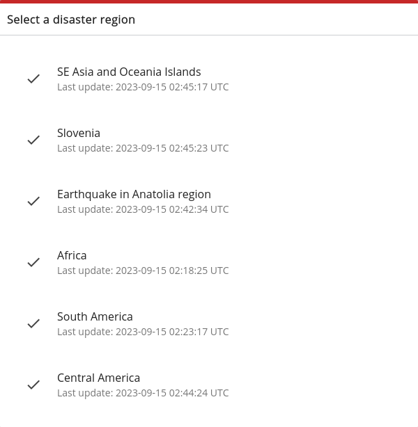
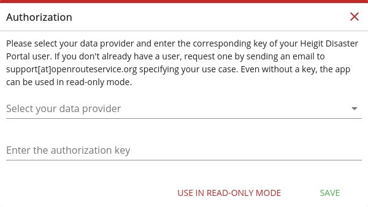
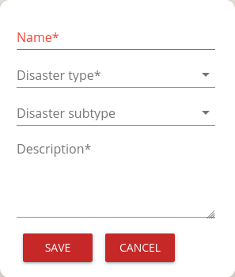

# Disaster Portal Documentation

Welcome to the HeiGIT Disaster Portal Documentation.

This will give you a short introduction on what the selected disaster region
means, how to use the client to add new disaster areas and how to calculate
routes.

## Disaster region selection

When starting the HeiGIT Disaster Portal, you'll be greeted by the following screen:

Selecting a disaster region will limit your routing capabilities to the selected region.

As an example, selecting the *Slovenia* region will result in the following
view.  Note, that everything *but* the selected region is not routable,
indicated by being greyed out.  OpenStreetMap data for the highlighted area
will be updated every 10 minutes. If a road is changed in OSM, e.g. marked as
impassable, this change will be respected after 15-20 minutes.

Compared to the classic client, the following controls are new or have special functionalities:

1. Activate [Administration Mode](#administration-mode) to add/edit areas
2. Re-open the region selection.
3. Control the loaded layers to toggle impassable areas
4. Add areas (only in [Administration Mode](#administration-mode)

## Administration Mode

To be able to add or edit any of the given areas, you have to have access to any given data provider.
TODO: Contact XYZ if you need to edit areas, but don't have any access token.

Select your Data Provider and enter your access token here:

Once you are authenticated, you can add polygons using the buttons mentioned in `4`.
Click to mark every corner of your polygon, and click on the first point to finish your polygon:

https://github.com/koebi/heigit-disaster-portal/assets/4692974/30d1ca1e-ce0e-4c9d-9e00-5c78f442640e

Once the polygon is finished, the following dialog will open up:

The following information can be set:

| Key         | Description |
| ----------- | ----------- |
| `Name` | Name of the drawn region |
| `Disaster type` | Specify the type of incindent that caused the impassable area. One of _earthquake_, _volcanic activity_, _storm_, _extreme temperature_, _flood_, _mass movement_, _drought_, _wildfire_, _epidemic_, _infestation_, _industrial accident_, _transport accident_, _humanitarian_ or _other_ |
| `Disaster subtype` (optional) | More detailed type of incident, depending on `Disaster type` |
| `Description` | Text field to input more information |

